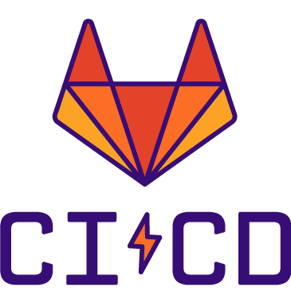

# Hey there, I'm Seakmeng 👋

## I'm a Student, and Backend Developer!!

- 🌱 Challenges are my friend.

 
 

---

## Languages and Frameworks:

 <b>PHP</b>  

 <b>Laravel</b>  

 <b>TypeScript</b>  

 <b>JavaScript</b>  

 <b>NestJS</b>  

 <b>ExpressJS</b>  

 <b>NodeJS</b>  

 
 

---

## Databases:

 <b>MySQL</b>   

 <b>MongoDB</b>  

 
 

---

## Other Technologies:

 <b>Docker</b>  

 <b>Redis</b>  

 <b>Linux</b>  

 <b>GitLab CI/CD</b>  

 <b>Socket.IO</b>  

 <b>WebRTC</b>  

 <b>Firebase Cloud Messaging</b>  

 <b>Git</b>  

 
 

---

